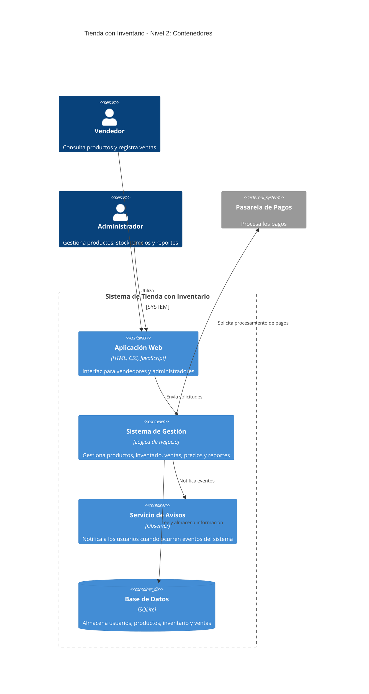

# C4 - Tienda con Inventario

## Nivel 1 - Contexto

```mermaid
C4Context

    title Tienda con Inventario - Nivel 1: Contexto

    Person(vendedor, "Vendedor", "Consulta productos y registra ventas")

    Person(administrador, "Administrador", "Gestiona productos, stock, precios y reportes")

    System(tienda, "Sistema de Tienda con Inventario", "Permite gestionar productos, inventario y ventas")

    System_Ext(pasarela, "Pasarela de Pagos", "Procesa los pagos de las ventas")

    Rel(vendedor, tienda, "Consulta productos y registra ventas")

    Rel(administrador, tienda, "Gestiona productos, stock, precios y reportes")

<<<<<<< HEAD
    Rel(tienda, pago, "Procesa pagos")
=======
    Rel(tienda, pasarela, "Envía solicitudes de pago")
```

## Nivel 2 - Contenedores


>>>>>>> 7cf3ef2939993e75af6df6ec9c58932f0917f6a2
