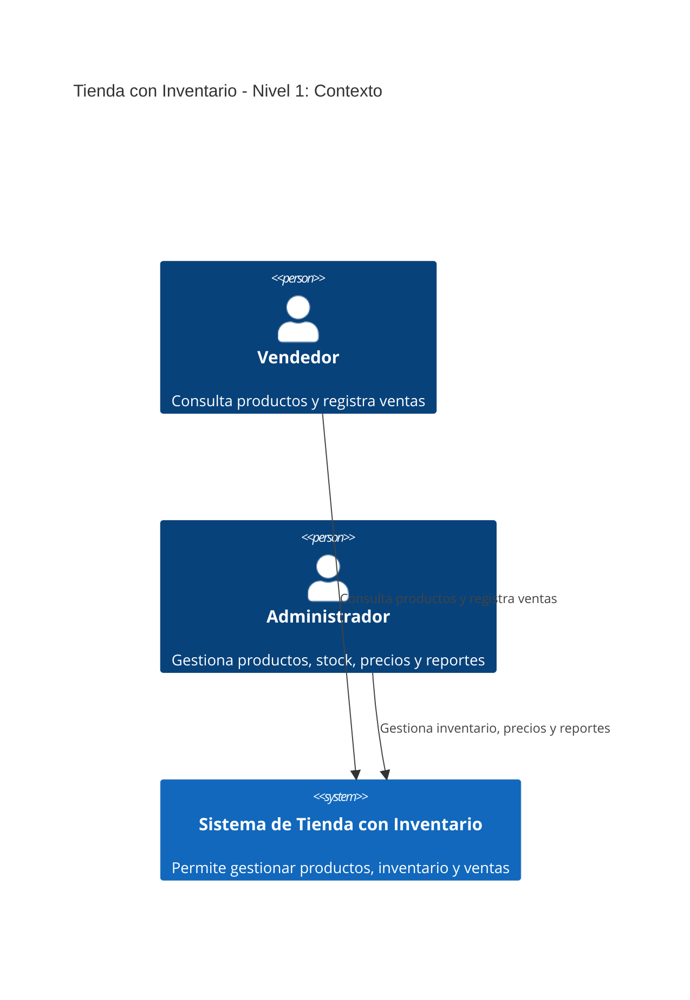
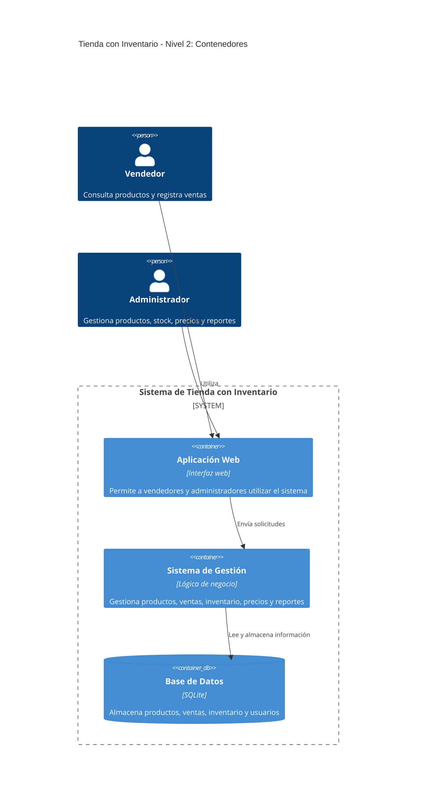

# C4 - Tienda con Inventario

## Nivel 1 - Contexto

```mermaid
C4Context
    title Tienda con Inventario - Nivel 1: Contexto

    Person(vendedor, "Vendedor", "Consulta productos y registra ventas")
    Person(administrador, "Administrador", "Gestiona productos, stock, precios y reportes")

    System(tienda, "Sistema de Tienda con Inventario", "Permite gestionar productos, inventario y ventas")

    Rel(vendedor, tienda, "Consulta productos y registra ventas")
    Rel(administrador, tienda, "Gestiona inventario, precios y reportes")
```
## Nivel 2 - Contenedores

```mermaid
C4Container
    title Tienda con Inventario - Nivel 2: Contenedores

    Person(vendedor, "Vendedor", "Consulta productos y registra ventas")
    Person(administrador, "Administrador", "Gestiona productos, stock, precios y reportes")

    System_Boundary(tienda, "Sistema de Tienda con Inventario") {
        Container(web, "Aplicación Web", "Interfaz web", "Permite a vendedores y administradores utilizar el sistema")
        Container(gestion, "Sistema de Gestión", "Lógica de negocio", "Gestiona productos, ventas, inventario, precios y reportes")
        ContainerDb(db, "Base de Datos", "SQLite", "Almacena productos, ventas, inventario y usuarios")
    }

    Rel(vendedor, web, "Utiliza")
    Rel(administrador, web, "Utiliza")

    Rel(web, gestion, "Envía solicitudes")
    Rel(gestion, db, "Lee y almacena información")
```