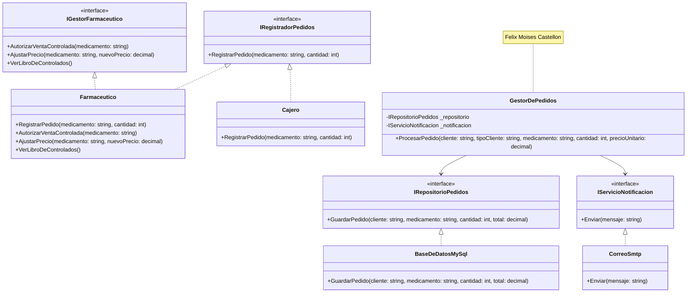

# Diagrama de Clases (Refactorizado)
#codigo copiado de mermaid para repositorio

```mermaid
classDiagram
    note for GestorDePedidos "Felix Moises Castellon"

    class IRegistradorPedidos {
        <<interface>>
        +RegistrarPedido(medicamento: string, cantidad: int)
    }

    class IGestorFarmaceutico {
        <<interface>>
        +AutorizarVentaControlada(medicamento: string)
        +AjustarPrecio(medicamento: string, nuevoPrecio: decimal)
        +VerLibroDeControlados()
    }

    class IRepositorioPedidos {
        <<interface>>
        +GuardarPedido(cliente: string, medicamento: string, cantidad: int, total: decimal)
    }

    class IServicioNotificacion {
        <<interface>>
        +Enviar(mensaje: string)
    }

    class Farmaceutico {
        +RegistrarPedido(medicamento: string, cantidad: int)
        +AutorizarVentaControlada(medicamento: string)
        +AjustarPrecio(medicamento: string, nuevoPrecio: decimal)
        +VerLibroDeControlados()
    }

    class Cajero {
        +RegistrarPedido(medicamento: string, cantidad: int)
    }

    class BaseDeDatosMySql {
        +GuardarPedido(cliente: string, medicamento: string, cantidad: int, total: decimal)
    }

    class CorreoSmtp {
        +Enviar(mensaje: string)
    }

    class GestorDePedidos {
        -IRepositorioPedidos _repositorio
        -IServicioNotificacion _notificacion
        +ProcesarPedido(cliente: string, tipoCliente: string, medicamento: string, cantidad: int, precioUnitario: decimal)
    }

    IRegistradorPedidos <|.. Farmaceutico
    IGestorFarmaceutico <|.. Farmaceutico
    IRegistradorPedidos <|.. Cajero

    IRepositorioPedidos <|.. BaseDeDatosMySql
    IServicioNotificacion <|.. CorreoSmtp

    GestorDePedidos --> IRepositorioPedidos
    GestorDePedidos --> IServicioNotificacion
```