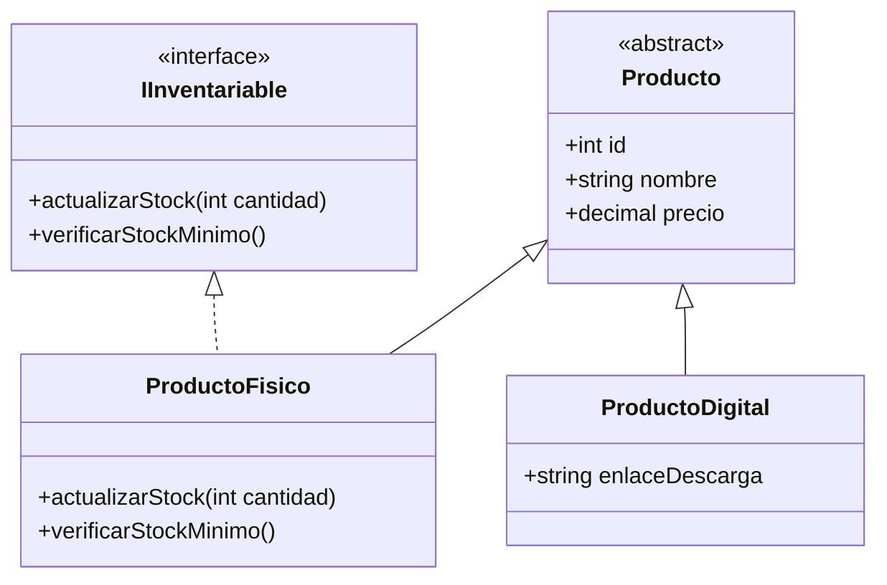
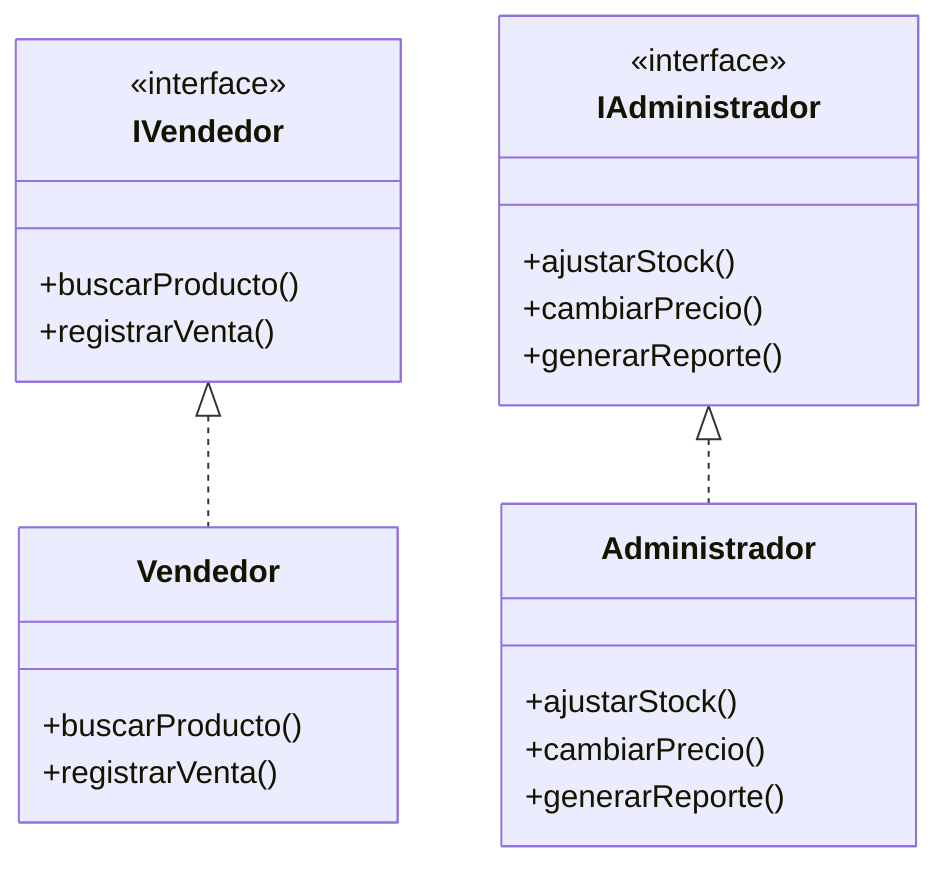

# Práctica C5: Principios SOLID (L - Liskov Substitution & I - Interface Segregation)

## 1. Identificación del Problema

### La "herencia mentirosa"

En el sistema de la tienda existen diferentes tipos de productos. No todos los productos necesitan las mismas características.

Por ejemplo, un `ProductoFisico` necesita controlar su stock porque se encuentra en el inventario de la tienda. En cambio, un `ProductoDigital` puede ser un producto descargable y no necesita controlar unidades físicas.

Si todos los productos heredaran una clase que obligatoriamente tenga métodos relacionados con el stock, `ProductoDigital` tendría que implementar funciones que realmente no necesita.

Esto puede provocar que se tengan métodos sin utilidad o que se tenga que colocar una respuesta falsa para cumplir con la clase padre.

Por ejemplo:

* `ProductoFisico` necesita actualizar el stock.
* `ProductoFisico` necesita verificar el stock mínimo.
* `ProductoDigital` no necesita ninguna de estas funciones.

Por lo tanto, se estaría forzando una herencia que no corresponde.

## 2. Solución propuesta

Para solucionar este problema se separan las características comunes de los productos de las características relacionadas con el inventario.

### Clase Producto

La clase `Producto` contiene solamente los datos que tienen en común todos los productos:

* id
* nombre
* precio

### Interfaz IInventariable

Se crea la interfaz `IInventariable` para las funciones relacionadas con el inventario:

* actualizarStock()
* verificarStockMinimo()

### ProductoFisico

`ProductoFisico` hereda de `Producto` y además implementa `IInventariable`, porque necesita controlar su existencia en la tienda.

### ProductoDigital

`ProductoDigital` hereda de `Producto`, pero no implementa `IInventariable`, porque no necesita controlar stock físico.

## 3. Diagrama de clases

## 4. Interface Segregation Principle (ISP)

En el sistema también existen diferentes tipos de usuarios.

No todos los usuarios necesitan realizar las mismas operaciones. Por ejemplo, un vendedor trabaja principalmente con productos y ventas, mientras que un administrador puede modificar precios, ajustar stock y generar reportes.

Por eso, en lugar de crear una sola interfaz grande para todos los usuarios, se separan las funciones según el tipo de usuario.

### IVendedor

Contiene las operaciones que necesita el vendedor:

* buscarProducto()
* registrarVenta()

### IAdministrador

Contiene las operaciones que necesita el administrador:

* ajustarStock()
* cambiarPrecio()
* generarReporte()

De esta manera, cada clase utiliza solamente las funciones que necesita.

## 5. Diagrama ISP

## 6. Justificación

### Liskov Substitution Principle (LSP)

Los diferentes tipos de productos pueden utilizarse como productos sin cambiar el comportamiento básico del sistema.

`ProductoFisico` puede utilizar las funciones de inventario porque realmente las necesita. `ProductoDigital` no está obligado a utilizar funciones relacionadas con stock.

### Interface Segregation Principle (ISP)

Las interfaces se separaron de acuerdo con las funciones de cada usuario.

El vendedor no depende de funciones administrativas que no utiliza y el administrador puede tener sus propias operaciones.

Con esto se evita tener interfaces demasiado grandes y se facilita el mantenimiento del sistema.
