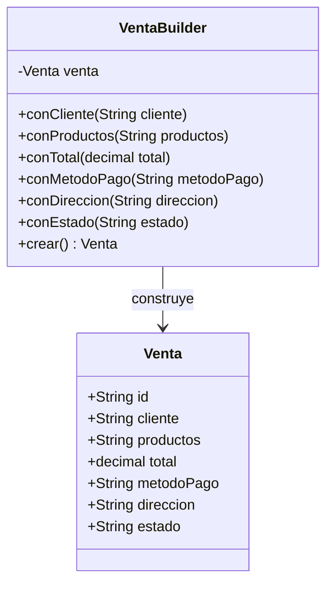
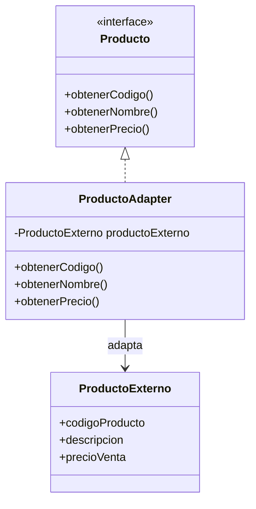

# Práctica C6: Patrones de Diseño (Builder & Adapter)

## 1. Builder

### Identificación del problema

En el sistema de la tienda, una `Venta` puede tener varios datos como cliente, productos, método de pago, dirección y estado.

Si todos estos datos se colocan directamente en el constructor, la creación de una venta puede ser difícil de entender. Además, si existen varios parámetros del mismo tipo, se pueden intercambiar por error y el programa puede seguir funcionando aunque la información sea incorrecta.

Por ejemplo:

```text
Venta(id, cliente, productos, total, metodoPago, direccion, estado)
```

El código puede compilar aunque dos valores sean colocados en una posición incorrecta.

### Solución con Builder

Se utiliza el patrón Builder para construir una venta paso a paso.

En lugar de colocar todos los datos directamente en el constructor, se pueden agregar de forma más clara:

```text
VentaBuilder()
    .conCliente(cliente)
    .conProductos(productos)
    .conMetodoPago(metodoPago)
    .conDireccion(direccion)
    .conEstado("Pendiente")
    .crear()
```

De esta manera, es más fácil revisar qué información se está colocando en la venta antes de crearla.

### Diagrama Builder



### Justificación

El patrón Builder permite construir una `Venta` de manera ordenada y fácil de leer.

También facilita la creación de ventas cuando algunos datos pueden cambiar o ser opcionales.

## 2. Adapter

### Identificación del problema

La tienda puede recibir información de productos desde otro sistema externo.

El problema es que el sistema externo puede manejar los datos de una forma diferente a la que utiliza nuestra tienda.

Por ejemplo, nuestro sistema utiliza:

```text
Producto
- codigo
- nombre
- precio
```

Mientras que el sistema externo puede utilizar:

```text
ProductoExterno
- codigoProducto
- descripcion
- precioVenta
```

No podemos modificar directamente la clase del sistema externo porque pertenece a otro sistema.

### Solución con Adapter

Se crea un adaptador que se encarga de convertir la información del producto externo al formato que utiliza nuestra tienda.

El `ProductoAdapter` recibe el producto externo y lo adapta para que pueda ser utilizado como un `Producto` dentro del sistema.

```text
ProductoExterno
       |
       v
ProductoAdapter
       |
       v
Producto
```

### Diagrama Adapter



### Justificación

El patrón Adapter permite conectar nuestro sistema con una clase externa sin modificarla.

El adaptador funciona como un intermediario que convierte los datos al formato que necesita la tienda.

## 3. Resultado

Con Builder se mejora la forma en que se crean objetos complejos como una `Venta`.

Con Adapter se puede conectar la tienda con sistemas externos que utilizan una estructura diferente.

Ambos patrones ayudan a organizar mejor el código y permiten agregar nuevas funcionalidades sin modificar demasiado las clases existentes.
